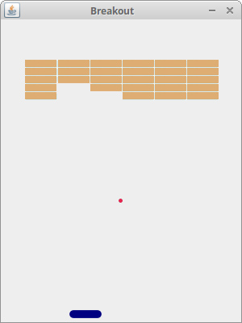

# Brick Game
A simple brick breaker game developed using Java.

## Prerequisites
1. Java Development Kit (JDK) 11 or higher
2. Integrated Development Environment (IDE) such as Eclipse or IntelliJ IDEA
## Installation
1. Clone or download the project repository.
2. Open the project in your IDE.
3. Compile the project using the IDE's build tools.
4. Run the game using the IDE's run configuration or by executing the main method of the Breakout class.
## Gameplay
Use the arrow keys to move the paddle left and right. The ball bounces off the paddle, the walls, and the bricks.
When the ball hits a brick, the brick is destroyed and the ball's velocity is changed. The goal of the game is to destroy all of the bricks.
### Screenshot

